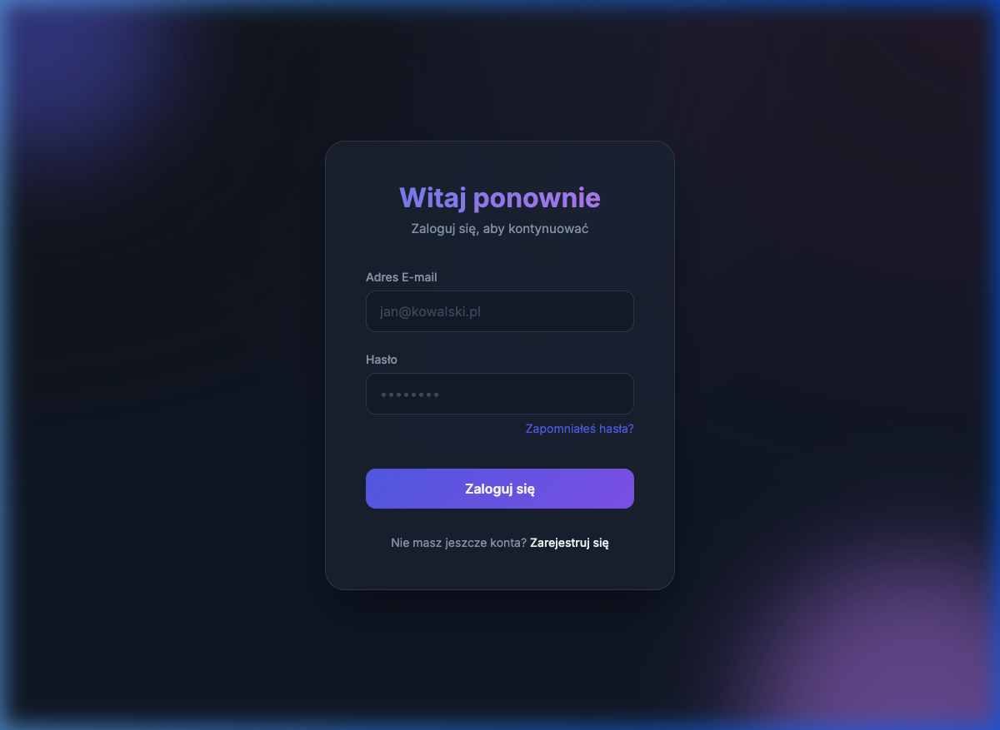
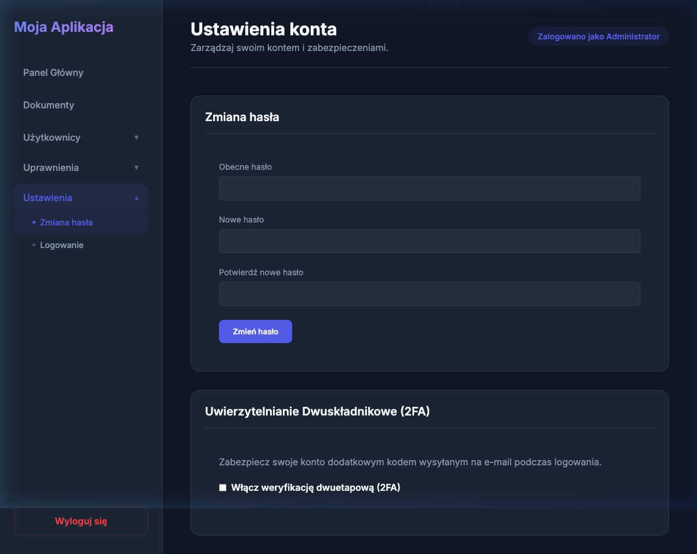
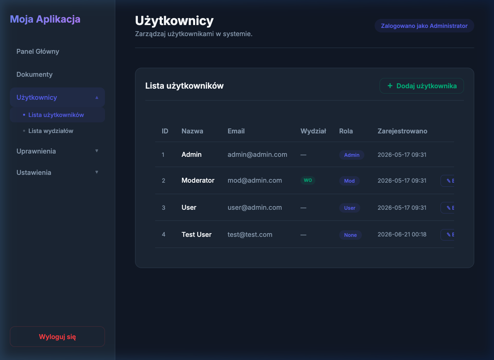
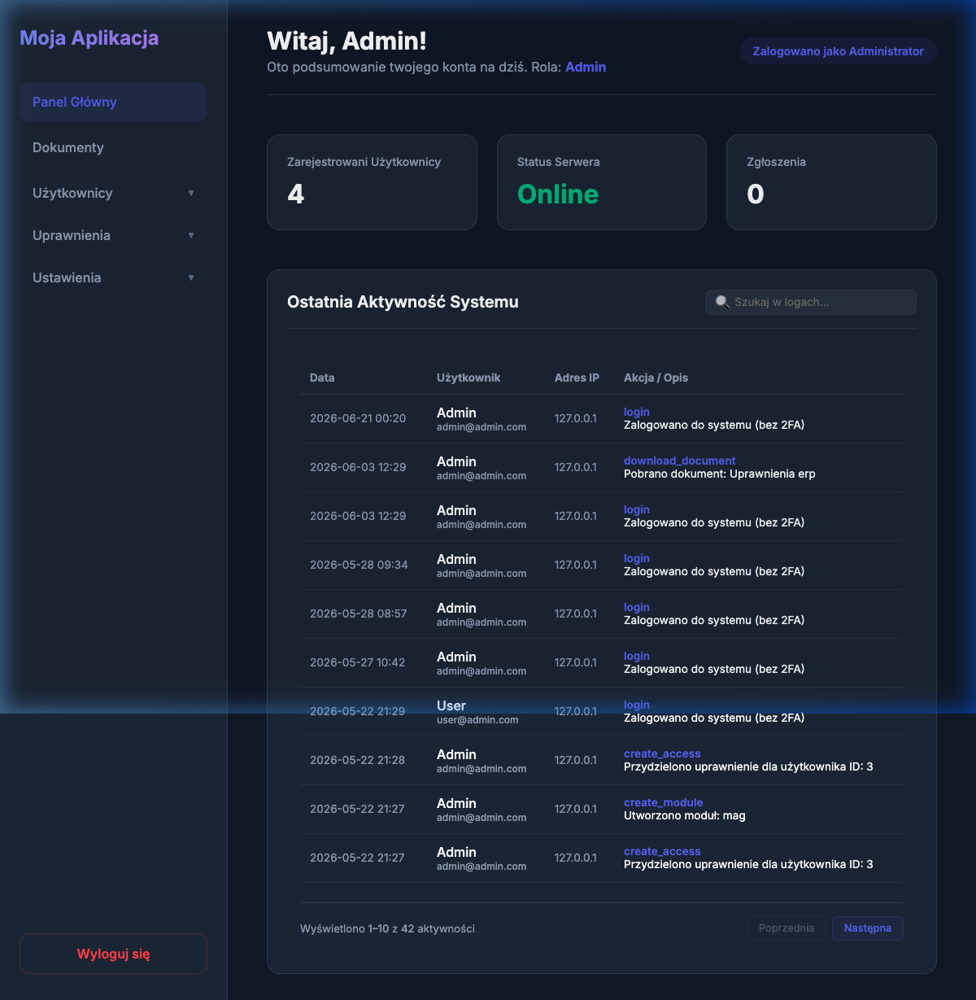

# 📋 Dokumentacja Aplikacji Web — System Zarządzania z 2FA

> **Platforma:** Laravel 12 · PHP · MySQL · Blade Templates · Vite  
> **Adres lokalny:** https://l-2fa.test/  
> **Wersja:** 1.0  
> **Data dokumentacji:** 2026-06-21

---

## Spis treści

1. [Przegląd systemu](#1-przegląd-systemu)
2. [🔐 LOGOWANIE — Uwierzytelnianie użytkownika](#2-logowanie--uwierzytelnianie-użytkownika)
3. [🛡️ DWUSKŁADNIKOWE UWIERZYTELNIANIE (2FA)](#3-dwuskładnikowe-uwierzytelnianie-2fa)
4. [⚙️ Zarządzanie ustawieniami 2FA](#4-zarządzanie-ustawieniami-2fa)
5. [👥 Zarządzanie użytkownikami](#5-zarządzanie-użytkownikami)
6. [🏢 Wydziały i działy](#6-wydziały-i-działy)
7. [🔑 System uprawnień](#7-system-uprawnień)
8. [📄 Zarządzanie dokumentami](#8-zarządzanie-dokumentami)
9. [📊 Panel główny (Dashboard)](#9-panel-główny-dashboard)
10. [🗂️ Architektura aplikacji](#10-architektura-aplikacji)

---

## 1. Przegląd systemu

Aplikacja to wielopoziomowy system zarządzania przedsiębiorstwem z zaawansowanym modułem bezpieczeństwa opartym na dwuskładnikowym uwierzytelnianiu (2FA via e-mail). System obsługuje cztery poziomy ról użytkowników:

| Rola | Opis uprawnień |
|------|----------------|
| **Admin** | Pełny dostęp do wszystkich modułów i ustawień globalnych |
| **Mod** (Moderator) | Zarządzanie użytkownikami w przypisanych wydziałach |
| **User** | Dostęp do dokumentów i własnych uprawnień |
| **None** | Konto bez przypisanej roli — widok ograniczony |

---

## 2. LOGOWANIE — Uwierzytelnianie użytkownika

### 2.1 Widok strony logowania

Strona logowania dostępna pod adresem głównym aplikacji `https://l-2fa.test/` prezentuje elegancki, ciemny interfejs z efektem glassmorphism.



**Elementy interfejsu:**
- Gradientowe tło z rozmytymi kształtami dekoracyjnymi
- Karta logowania ze szklanym efektem (dark glassmorphism)
- Pola: **Adres E-mail** i **Hasło**
- Przycisk „Zapomniałeś hasła?" (link pomocniczy)
- Przycisk **„Zaloguj się"** (fioletowy, wyróżniony)
- Odnośnik do rejestracji nowego konta

---

### 2.2 Proces logowania — kod kontrolera

Logowanie obsługiwane jest przez [`LoginController.php`](app/Http/Controllers/Frontend/LoginController.php).

**Pełny przepływ autentykacji (`authenticate()`):**

```php
// app/Http/Controllers/Frontend/LoginController.php

public function authenticate(Request $request)
{
    $credentials = $request->validate([
        'email'    => ['required', 'email'],
        'password' => ['required'],
    ]);

    if (Auth::validate($credentials)) {
        $user = Auth::getProvider()->retrieveByCredentials($credentials);

        // Sprawdzenie czy konto jest aktywne
        if (!$user->is_active) {
            UserActivity::log('login_failed',
                "Próba logowania na zablokowane konto: {$user->email}");
            return back()->withErrors([
                'email' => 'Twoje konto zostało zdezaktywowane.',
            ])->onlyInput('email');
        }

        // Pobranie ustawień globalnych systemu
        $settings = Setting::pluck('value', 'key')->toArray();
        $global2faEnabled = (bool) ($settings['enable_2fa'] ?? false);
        $force2fa         = (bool) ($settings['force_2fa_mod_user'] ?? false);
        $isUserForced     = $force2fa && in_array($user->role, ['mod', 'user']);

        // Logika 2FA
        if ($global2faEnabled && ($user->two_factor_enabled || $isUserForced)) {
            // → Przekieruj do weryfikacji 2FA
        }

        // Logowanie bez 2FA
        Auth::login($user);
        UserActivity::log('login', 'Zalogowano do systemu (bez 2FA)');
        $request->session()->regenerate();
        return redirect()->intended('/dashboard');
    }

    return back()->withErrors([
        'email' => 'Podane dane logowania są nieprawidłowe.',
    ])->onlyInput('email');
}
```

---

### 2.3 Diagram przepływu logowania

```
Użytkownik wpisuje e-mail + hasło
            │
            ▼
    ┌───────────────────┐
    │  Walidacja danych │
    │  (email, hasło)   │
    └────────┬──────────┘
             │ Poprawne
             ▼
    ┌───────────────────────┐
    │  Czy konto aktywne?   │
    └────┬──────────────────┘
         │ NIE → Błąd: konto zablokowane
         │ TAK
         ▼
    ┌──────────────────────────────────┐
    │  Czy 2FA włączone globalnie      │
    │  ORAZ (user ma 2FA lub forced)?  │
    └────┬─────────────────────────────┘
         │ TAK                │ NIE
         ▼                    ▼
  Generuj kod 6-cyfr    Auth::login()
  Wyślij e-mail         Regeneruj sesję
  Redirect → /login/2fa Redirect → /dashboard
```

---

### 2.4 Model użytkownika — pola bezpieczeństwa

```php
// app/Models/User.php

#[Fillable([
    'name', 'email', 'password', 'role',
    'two_factor_enabled',    // bool: czy 2FA aktywne
    'two_factor_code',       // 6-cyfrowy kod OTP
    'two_factor_expires_at', // czas wygaśnięcia kodu
    'is_active'              // bool: czy konto aktywne
])]
class User extends Authenticatable
{
    protected function casts(): array
    {
        return [
            'password'           => 'hashed',
            'two_factor_enabled' => 'boolean',
            'is_active'          => 'boolean',
        ];
    }
}
```

---

### 2.5 Logowanie aktywności

Każde logowanie jest rejestrowane w tabeli `user_activities` przez statyczną metodę:

```php
// app/Models/UserActivity.php

public static function log($action, $description = null)
{
    self::create([
        'user_id'     => auth()->id(),
        'action'      => $action,       // np. 'login', 'login_failed'
        'description' => $description,  // np. 'Zalogowano z użyciem 2FA'
        'ip_address'  => request()->ip(),
    ]);
}
```

> Przykłady rejestrowanych zdarzeń: `login`, `login_failed`, `toggle_2fa`, `update_password`

---

### 2.6 Widok formularza logowania (Blade)

```html
<!-- resources/views/Frontend/login.blade.php -->

<form action="{{ route('login.post') }}" method="POST"
      onsubmit="this.querySelector('button[type=submit]').disabled = true;">
    @csrf
    <div class="form-group">
        <label for="email">Adres E-mail</label>
        <input type="email" id="email" name="email"
               placeholder="jan@kowalski.pl" required>
    </div>
    <div class="form-group">
        <label for="password">Hasło</label>
        <input type="password" id="password" name="password"
               placeholder="••••••••" required>
    </div>
    <button type="submit" class="btn-submit">Zaloguj się</button>
</form>
```

> **Zabezpieczenie UX:** Po kliknięciu przycisku jest on natychmiast wyłączany (`disabled = true`), co zapobiega wielokrotnemu wysłaniu formularza.

---

## 3. DWUSKŁADNIKOWE UWIERZYTELNIANIE (2FA)

### 3.1 Co to jest 2FA w tej aplikacji?

System 2FA (Two-Factor Authentication) dodaje drugi poziom weryfikacji do procesu logowania. Po poprawnym podaniu hasła, system wysyła **6-cyfrowy jednorazowy kod OTP** na adres e-mail użytkownika. Kod ma ograniczony czas ważności (konfigurowalny przez admina).

### 3.2 Generowanie i wysyłanie kodu

```php
// Fragment LoginController::authenticate()

// 1. Generowanie losowego kodu 6-cyfrowego
$code = rand(100000, 999999);

// 2. Pobranie czasu ważności z ustawień (domyślnie 5 minut)
$expirationTime = (int) ($settings['two_factor_expiration_time'] ?? 5);

// 3. Zapis kodu i czasu wygaśnięcia w bazie danych
$user->two_factor_code       = $code;
$user->two_factor_expires_at = now()->addMinutes($expirationTime);
$user->save();

// 4. Konfiguracja SMTP dynamicznie z ustawień bazy
if (!empty($settings['smtp_host'])) {
    Config::set('mail.default', 'smtp');
    Config::set('mail.mailers.smtp.host',     $settings['smtp_host']);
    Config::set('mail.mailers.smtp.port',     $settings['smtp_port']);
    Config::set('mail.mailers.smtp.username', $settings['smtp_username']);
    Config::set('mail.mailers.smtp.password', $settings['smtp_password']);
    Config::set('mail.mailers.smtp.encryption', $settings['smtp_encryption']);
    Config::set('mail.from.address', $settings['smtp_from_address']);
    Config::set('mail.from.name',    $settings['smtp_from_name']);
}

// 5. Wysłanie e-maila z kodem
Mail::to($user->email)->send(new TwoFactorCodeMail($code));

// 6. Zapis ID użytkownika w sesji (nie logujemy go jeszcze!)
$request->session()->put('2fa:user:id', $user->id);

// 7. Przekierowanie do formularza weryfikacji
return redirect()->route('login.2fa');
```

---

### 3.3 Formularz weryfikacji 2FA

Strona weryfikacji `https://l-2fa.test/login/2fa` utrzymuje spójny wygląd z ekranem logowania. Zawiera pole na 6-cyfrowy kod z wyróżnionym stylem (duże cyfry, spacja między nimi).

```html
<!-- resources/views/Frontend/2fa.blade.php -->

<input type="text"
       id="two_factor_code"
       name="two_factor_code"
       placeholder="123456"
       maxlength="6"
       autofocus
       autocomplete="off"
       style="text-align: center;
              letter-spacing: 0.5rem;
              font-size: 1.25rem;
              font-weight: 600;">
```

---

### 3.4 Weryfikacja kodu 2FA

```php
// app/Http/Controllers/Frontend/LoginController.php

public function verify2fa(Request $request)
{
    $request->validate([
        'two_factor_code' => 'required|numeric',
    ]);

    $userId = $request->session()->get('2fa:user:id');
    if (!$userId) {
        return redirect()->route('login');
    }

    $user = User::find($userId);

    // Sprawdzenie poprawności kodu
    if (!$user || $user->two_factor_code !== $request->two_factor_code) {
        return back()->with('error', 'Wprowadzony kod jest nieprawidłowy.');
    }

    // Sprawdzenie czy kod nie wygasł
    if (now()->greaterThan($user->two_factor_expires_at)) {
        $user->two_factor_code       = null;
        $user->two_factor_expires_at = null;
        $user->save();
        $request->session()->forget('2fa:user:id');

        return redirect()->route('login')
            ->withErrors(['email' => 'Kod weryfikacyjny wygasł. Zaloguj się ponownie.']);
    }

    // SUKCES: Czyszczenie kodu i logowanie użytkownika
    $user->two_factor_code       = null;
    $user->two_factor_expires_at = null;
    $user->save();

    Auth::login($user);
    UserActivity::log('login', 'Zalogowano do systemu (z użyciem 2FA)');

    $request->session()->forget('2fa:user:id');
    $request->session()->regenerate();

    return redirect()->intended('/dashboard');
}
```

---

### 3.5 Routing 2FA

```php
// routes/web.php

// Publiczne (bez auth)
Route::get('/', fn() => view('Frontend.login'))->name('login');
Route::post('/login',     [LoginController::class, 'authenticate'])->name('login.post');
Route::get('/login/2fa',  [LoginController::class, 'show2faForm'])->name('login.2fa');
Route::post('/login/2fa', [LoginController::class, 'verify2fa'])->name('login.2fa.verify');
Route::post('/logout',    [LoginController::class, 'logout'])->name('logout');
```

> **Ochrona trasy 2FA:** Formularz weryfikacji (`/login/2fa`) dostępny jest tylko gdy w sesji istnieje klucz `2fa:user:id`. Bez niego następuje przekierowanie do logowania.

```php
public function show2faForm(Request $request)
{
    if (!$request->session()->has('2fa:user:id')) {
        return redirect()->route('login'); // Blokada bezpośredniego dostępu
    }
    return view('Frontend.2fa');
}
```

---

### 3.6 Diagram weryfikacji 2FA

```
Użytkownik wpisuje kod z e-maila
            │
            ▼
    ┌──────────────────────┐
    │  Czy sesja zawiera   │
    │  '2fa:user:id' ?     │
    └────┬─────────────────┘
         │ NIE → redirect /login
         │ TAK
         ▼
    ┌──────────────────────┐
    │  Pobierz User z BD   │
    └────┬─────────────────┘
         │
         ▼
    ┌──────────────────────────────┐
    │  Czy kod == user.2fa_code ?  │
    └────┬─────────────────────────┘
         │ NIE → Błąd: nieprawidłowy kod
         │ TAK
         ▼
    ┌─────────────────────────────────┐
    │  Czy now() > expires_at ?       │
    └────┬────────────────────────────┘
         │ TAK → Kasuj kod, redirect /login (wygasł)
         │ NIE
         ▼
    Kasuj kod z bazy
    Auth::login($user)
    Regeneruj sesję
    UserActivity::log('login', '... z użyciem 2FA')
    Redirect → /dashboard ✅
```

---

## 4. Zarządzanie ustawieniami 2FA



Panel ustawień (`/settings`) pozwala na:

### 4.1 Ustawienia użytkownika (każda rola)

- **Zmiana hasła** — weryfikacja obecnego hasła, wymagane potwierdzenie nowego
- **Włączenie/wyłączenie 2FA** — własny przełącznik dla konta (checkbox)

```php
// SettingsController::toggle2fa()

public function toggle2fa(Request $request)
{
    $user     = Auth::user();
    $settings = Setting::pluck('value', 'key')->toArray();
    $force2fa = (bool) ($settings['force_2fa_mod_user'] ?? false);

    // Jeśli admin wymusił 2FA dla mod/user — nie można wyłączyć
    if ($force2fa && in_array($user->role, ['mod', 'user'])) {
        return back()->withErrors([
            '2FA jest wymuszone przez administratora i nie może zostać wyłączone.'
        ]);
    }

    $user->two_factor_enabled = $request->has('two_factor_enabled');
    $user->save();
}
```

### 4.2 Ustawienia globalne (tylko Admin — `/settings/logon`)

| Parametr | Typ | Opis |
|----------|-----|------|
| `enable_2fa` | boolean | Globalne włączenie systemu 2FA |
| `force_2fa_mod_user` | boolean | Wymuszenie 2FA dla ról mod i user |
| `two_factor_expiration_time` | int (min) | Czas ważności kodu OTP |
| `smtp_host/port/...` | string | Konfiguracja serwera e-mail |
| `min_password_length` | int | Minimalna długość hasła |
| `activity_log_retention_days` | int | Retencja logów aktywności |

> Gdy admin włączy `force_2fa_mod_user`, system automatycznie ustawia `two_factor_enabled = 1` dla **wszystkich** użytkowników z rolą `mod` i `user`.

---

## 5. Zarządzanie użytkownikami



### 5.1 Dostępność modułu

| Rola | Widok listy | Tworzenie | Edycja | Usuwanie |
|------|-------------|-----------|--------|----------|
| Admin | Wszyscy | ✅ | ✅ | ✅ |
| Mod | Tylko ze swoich wydziałów | ❌ | ❌ | ❌ |
| User | ❌ | ❌ | ❌ | ❌ |

### 5.2 Tworzenie użytkownika

```php
// UserController::store()

$user = User::create([
    'name'     => $validated['name'],
    'email'    => $validated['email'],
    'password' => Hash::make($validated['password']),
    'role'     => $validated['role'],  // admin | mod | user | none
]);

// Przypisanie do wydziałów (relacja many-to-many)
if (!empty($validated['departments'])) {
    $user->departments()->attach($validated['departments']);
}
```

### 5.3 Zabezpieczenia przy edycji

- **Administrator nie może sam sobie obniżyć roli** — rola zostaje zachowana przy edycji własnego konta
- **Administrator nie może usunąć własnego konta**
- Nie można usunąć użytkownika posiadającego przypisane uprawnienia

---

## 6. Wydziały i działy

Wydziały (`Departament`) są jednostkami organizacyjnymi. Użytkownicy mogą być przypisani do wielu wydziałów (relacja `many-to-many` przez tabelę `DepartamentUsers`).

```php
// User.php
public function departments()
{
    return $this->belongsToMany(
        Departament::class, 'DepartamentUsers', 'ID_Users', 'ID_Departament'
    );
}
```

Moderator widzi i zarządza tylko użytkownikami z wydziałów, do których sam należy.

---

## 7. System uprawnień

System uprawnień oparty jest na trzech tabelach:

| Tabela | Opis |
|--------|------|
| `P_modul` | Moduły systemu (np. „Magazyn", „HR") z hierarchią rodzic–dziecko |
| `P_operacje` | Operacje możliwe w modułach (np. „Odczyt", „Zapis") |
| `P_access` | Przypisanie użytkownik + moduł + operacja + daty ważności |

### 7.1 Walidacja uprawnień

```php
// User::hasActiveAccess()

public function hasActiveAccess($moduleName, $operationName)
{
    if ($this->role === 'admin') {
        return true; // Admin ma zawsze dostęp
    }

    $accesses = $this->pAccesses()
        ->whereHas('modul',    fn($q) => $q->where('nazwa', $moduleName))
        ->whereHas('operacja', fn($q) => $q->where('nazwa', $operationName))
        ->get();

    foreach ($accesses as $access) {
        if ($access->isValid()) {
            return true; // Sprawdzenie dat ważności
        }
    }
    return false;
}
```

---

## 8. Zarządzanie dokumentami

Moduł dokumentów umożliwia przechowywanie plików powiązanych z modułami systemu uprawnień.

### 8.1 Funkcje modułu

- **Przeglądanie** — dostępne dla ról admin, mod, user
- **Dodawanie / edycja / usuwanie** — tylko admin
- **Pobieranie** — wszystkie zalogowane role (z logowaniem zdarzenia)

### 8.2 Przechowywanie plików

```php
// DocumentController::store()

$file = $request->file('file');
$path = $file->store('documents', 'local'); // Lokalny dysk serwera

Document::create([
    'nazwa'             => $validated['nazwa'],
    'file_path'         => $path,
    'original_filename' => $file->getClientOriginalName(),
    'p_modul_id'        => $validated['p_modul_id'],
]);
```

> Pliki przechowywane są w katalogu `storage/app/documents/` poza katalogiem publicznym (bezpieczne — nie dostępne bezpośrednio przez URL).

---

## 9. Panel główny (Dashboard)



Panel wyświetlany po zalogowaniu jest dynamicznie dopasowywany do roli:

| Rola | Widok dashboardu |
|------|-----------------|
| **Admin** | Statystyki (liczba użytkowników, status serwera) + pełny log aktywności z wyszukiwarką |
| **Mod** | Liczba użytkowników z przypisanych wydziałów |
| **User** | Lista własnych uprawnień dostępu (moduł + operacja) |
| **None** | Widok ograniczony bez danych |

### 9.1 Logi aktywności (Admin)

Administrator widzi w czasie rzeczywistym logi wszystkich działań: Data, Użytkownik, Adres IP, Akcja i opis. Wbudowana wyszukiwarka z debounce (400ms) umożliwia filtrowanie logów bez przeładowania strony.

```javascript
// Debounce wyszukiwania w logach
searchInput.addEventListener('input', function () {
    clearTimeout(debounceTimer);
    debounceTimer = setTimeout(function () {
        document.getElementById('search-form').submit();
    }, 400);
});
```

### 9.2 Automatyczna retencja logów

Logi starsze niż skonfigurowana liczba dni są automatycznie usuwane. Czyszczenie uruchamia się losowo z prawdopodobieństwem 1/20 przy każdym nowym zdarzeniu:

```php
if (rand(1, 20) === 1) {
    self::prune(); // Usuwa wpisy starsze niż activity_log_retention_days
}
```

---

## 10. Architektura aplikacji

### 10.1 Struktura katalogów

```
Project-web-2fa/
├── app/
│   ├── Http/
│   │   └── Controllers/
│   │       ├── Frontend/
│   │       │   ├── LoginController.php     ← Logowanie + 2FA
│   │       │   └── RegisterController.php  ← Rejestracja
│   │       └── Backend/
│   │           ├── SettingsController.php  ← Ustawienia konta i 2FA
│   │           ├── UserController.php      ← CRUD użytkowników
│   │           ├── DepartmentController.php← Wydziały
│   │           ├── PModulController.php    ← Moduły uprawnień
│   │           ├── POperacjeController.php ← Operacje uprawnień
│   │           ├── PAccessController.php   ← Przypisywanie uprawnień
│   │           └── DocumentController.php  ← Dokumenty
│   ├── Models/
│   │   ├── User.php          ← Model użytkownika (2FA fields)
│   │   ├── UserActivity.php  ← Logi aktywności
│   │   ├── Setting.php       ← Ustawienia globalne systemu
│   │   ├── Departament.php   ← Wydziały
│   │   ├── PModul.php        ← Moduły
│   │   ├── POperacje.php     ← Operacje
│   │   ├── PAccess.php       ← Uprawnienia
│   │   └── Document.php      ← Dokumenty
│   └── Mail/
│       └── TwoFactorCodeMail.php  ← Wysyłka kodu 2FA e-mailem
├── resources/views/
│   ├── Frontend/
│   │   ├── login.blade.php   ← Strona logowania
│   │   ├── 2fa.blade.php     ← Weryfikacja 2FA
│   │   └── register.blade.php
│   └── Backend/
│       ├── admin/            ← Widoki admina
│       ├── mod/              ← Widoki moderatora
│       ├── user/             ← Widoki użytkownika
│       └── none/             ← Widok konta bez roli
├── routes/
│   └── web.php               ← Definicja wszystkich tras
└── public/
    └── css/auth.css          ← Style stron logowania
```

### 10.2 Kluczowe zależności

| Pakiet | Wersja | Zastosowanie |
|--------|--------|--------------|
| Laravel | 12.x | Framework PHP |
| Vite | 8.x | Bundler CSS/JS |
| Inter (Google Fonts) | — | Typografia |

### 10.3 Zabezpieczenia systemu

- ✅ **CSRF** — wszystkie formularze POST chronione tokenem `@csrf`
- ✅ **Haszowanie haseł** — bcrypt przez `Hash::make()`
- ✅ **Regeneracja sesji** — po każdym zalogowaniu (`session()->regenerate()`)
- ✅ **Blokada konta** — pole `is_active`, administrator może dezaktywować konto
- ✅ **Timeout kodu 2FA** — konfigurowalny czas wygaśnięcia
- ✅ **Dynamiczny SMTP** — dane serwera pocztowego przechowywane w bazie, nie w `.env`
- ✅ **Logi aktywności** — każde zdarzenie bezpieczeństwa jest rejestrowane z IP
- ✅ **Izolacja ról** — moderator nie ma dostępu do zasobów poza swoimi wydziałami

---

*Dokumentacja wygenerowana automatycznie na podstawie kodu źródłowego aplikacji.*
